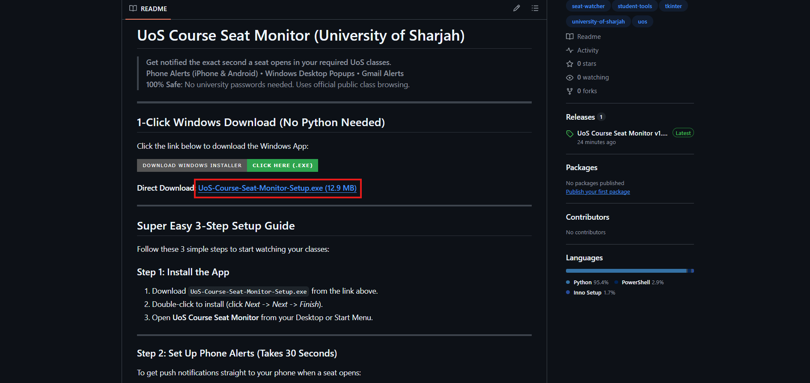
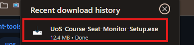
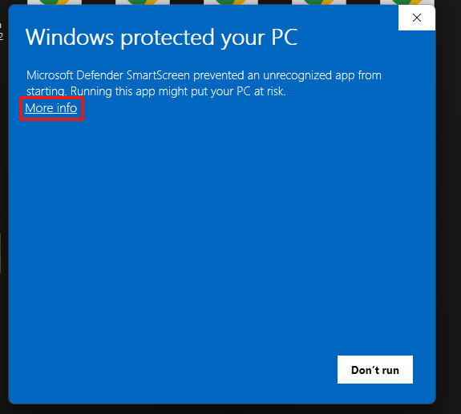
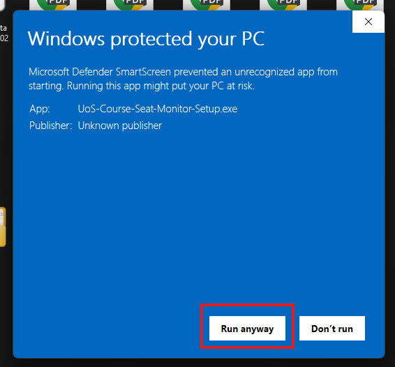
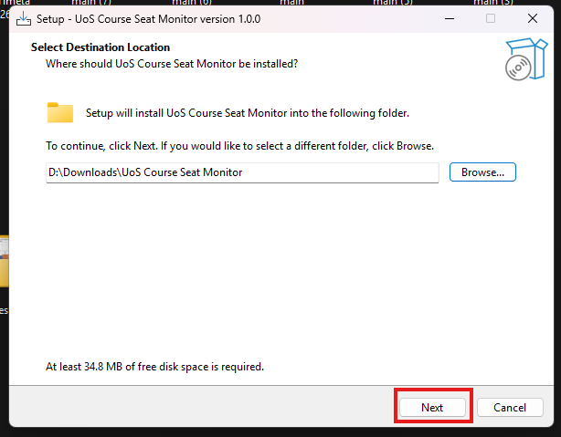
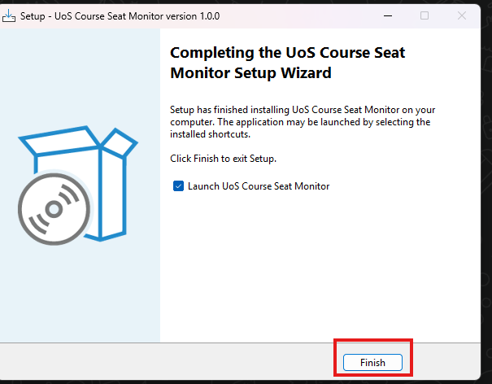
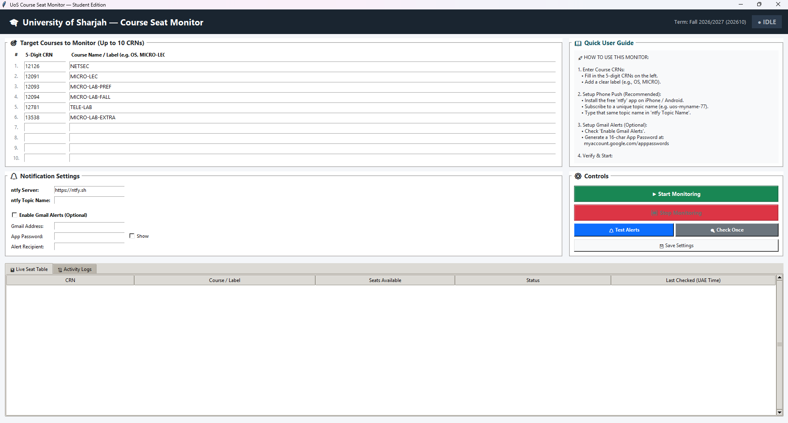

# UoS Course Seat Monitor (University of Sharjah)

> **Get notified the exact second a seat opens in your required UoS classes.**  
> **Phone Alerts (iPhone & Android)** • **Windows Desktop Popups** • **Gmail Alerts**  
> **100% Safe:** No university passwords needed. Uses official public class browsing.

---

## 1-Click Windows Download (No Python Needed)

Click the link below to download the Windows App:

[-2ea44f?style=for-the-badge&logo=windows)](https://github.com/IamOumarIbrahim/class-watcher-uos/releases/download/v1.0.0/UoS-Course-Seat-Monitor-Setup.exe)

**Direct Download:** [**UoS-Course-Seat-Monitor-Setup.exe (12.9 MB)**](https://github.com/IamOumarIbrahim/class-watcher-uos/releases/download/v1.0.0/UoS-Course-Seat-Monitor-Setup.exe)

---

## Step-by-Step Visual Installation Guide

Follow these steps to set up and run the monitor:

### Step 1: Download the Installer
Click the **Direct Download** link on the GitHub page to download `UoS-Course-Seat-Monitor-Setup.exe`.



---

### Step 2: Open the Downloaded Setup File
Open your browser download history or Downloads folder and click `UoS-Course-Seat-Monitor-Setup.exe`.



---

### Step 3: Windows Protection Prompt (Click "More info")
If the Windows Defender SmartScreen window appears, click **More info**.



---

### Step 4: Click "Run anyway"
Click the **Run anyway** button to launch the installer wizard.



---

### Step 5: Setup Wizard (Click "Next")
Select your preferred installation directory (or keep the default) and click **Next**.



---

### Step 6: Complete Installation (Click "Finish")
Keep **Launch UoS Course Seat Monitor** selected and click **Finish**.



---

### Step 7: Configure and Start Monitoring
1. Type the 5-digit CRNs you want to watch with optional course labels.
2. Enter your private **ntfy Topic Name** for phone alerts (and optional Gmail details).
3. Click **Test Alerts** to verify your devices receive notifications.
4. Click **Start Monitoring** to begin live monitoring.



---

## Setting Up Phone Alerts (ntfy App)

1. On your phone, install the free **ntfy** app:
   - [Download for iPhone (Apple App Store)](https://apps.apple.com/us/app/ntfy/id1625396347)
   - [Download for Android (Google Play Store)](https://play.google.com/store/apps/details?id=io.heckel.ntfy)
2. Open the **ntfy** app on your phone, tap **+ (Add Topic)**, and type any secret name you like (for example: `uos-student-alerts-77`).
3. In the Windows monitor app, type that exact same name in the **"ntfy Topic Name"** box.
4. Click **Test Alerts** to confirm your phone rings!

---

## Frequently Asked Questions (FAQ)

<details>
<summary><b>1. What is a CRN and where do I find it?</b></summary>
<br>
A CRN is the 5-digit Course Reference Number (for example: <code>12091</code>, <code>12011</code>). You can find it on the UoS Banner course registration page right next to the section title.
</details>

<details>
<summary><b>2. Do I need to give my University / Microsoft password?</b></summary>
<br>
<b>NO.</b> Never share your password. This monitor checks public course availability and does not require your student login.
</details>

<details>
<summary><b>3. Will this app register the class for me automatically?</b></summary>
<br>
<b>NO.</b> University regulations strictly forbid automated bot registration. This app is a <b>notification tool only</b> — it immediately alerts your phone the millisecond a seat drops so you can open Banner and register the seat yourself before anyone else.
</details>

<details>
<summary><b>4. Does my laptop need to stay on?</b></summary>
<br>
<b>YES.</b> The app continuously checks the system every 30 seconds. Keep your laptop plugged into power, prevent it from going to sleep (keep the lid open or adjust Windows sleep settings), and connected to the internet.
</details>

<details>
<summary><b>5. How do I stop tracking a class once I register it?</b></summary>
<br>
Simply delete its CRN from the box in the app, or replace it with another course you need, and click <b>"Save Settings"</b>.
</details>

---

## For Developers / Running from Source Code

If you prefer to run from Python source:

```powershell
# 1. Clone the repository
git clone https://github.com/IamOumarIbrahim/class-watcher-uos.git
cd class-watcher-uos/uos-seat-monitor

# 2. Setup virtual environment
.\install.ps1

# 3. Run the GUI
.\run_gui.ps1

# (Or run via command line)
.\.venv\Scripts\python.exe monitor.py
```
